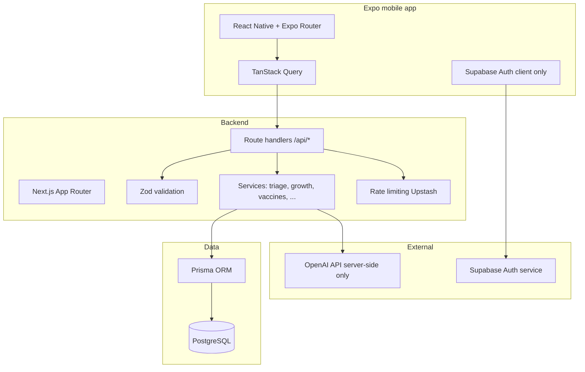

# Nurture AI — Master architecture & execution plan

**Brand:** From first breath to first steps — smart, AI-powered guidance for every parenting moment.

This document is the single source of truth for **system design**, **feature scope**, **security boundaries**, and the **ordered build backlog** (mobile + API + data). It aligns the repo with the production parent-guidance OS vision while staying shippable in phases.

---

## 1. System architecture (production shape)

**Non-negotiables**

| Rule | Implementation |
|------|------------------|
| Mobile never touches Postgres directly | All reads/writes via HTTPS to Next `/api/*` |
| Mobile never calls OpenAI | Only server routes with secrets |
| Supabase = auth/session only | JWT to API; `users` row synced via Prisma |
| Product data in PostgreSQL | Prisma models + migrations |
| Ownership | Every mutation checks `userId` / child ownership |

---

## 2. Repository layout (current + intended)

| Area | Path | Role |
|------|------|------|
| Mobile | `apps/mobile/` | Expo Router, NativeWind, Inter, TanStack Query, `lib/api.ts` → REST |
| Web API | `nurtureai/app/api/` | REST handlers, Zod, services |
| Services | `nurtureai/lib/services/` | Business logic, Prisma, OpenAI |
| DB | `nurtureai/prisma/` | Schema + migrations |
| Auth bridge | `nurtureai/lib/supabase/` | Request user from Bearer or cookies |
| Proxy/CORS | `nurtureai/proxy.ts` | Next 16 proxy: session refresh + CORS for Expo web |

---

## 3. Feature inventory vs repo (honest status)

| # | Feature area | Spec depth | In repo today | Next increment |
|---|----------------|------------|---------------|----------------|
| 1 | Symptom triage | Full | Follow-up + rules + AI final; `decision_diff`, watch-next, 811/911 by region, safety visibility, analytics | Further polish / A/B copy |
| 2 | Age guidance | Full | Home + child “Today’s insight” card, visit-prep API by stage, feeding/sleep copy | Optional persisted `Insight` table + push |
| 3 | Daily engagement | Full | Insights API + home card | Cron/push for daily nudges |
| 4 | Vaccines | Full | Ontario schedule, province, child vaccines | Push notifications on reminders |
| 5 | Growth | Full | WHO percentiles API + UI + shareable percentile table | Trend alerts |
| 6 | Milestones | Full | Definitions + child progress + delay guidance copy | Deeper analytics |
| 7 | Feeding | Full | Guidance + allergen checklist (CPS-style) + log API | More progression tooling |
| 8 | Sleep | Full | Guidance + log API (`lib/wellness` namespace server-side) | Regression scoring |
| 9 | Toddler / behavior | Full | Light copy in places | Dedicated module + content |
|10 | Preschool / school readiness | Full | Stubs / roadmap | New screens + content |
|11 | Child timeline | Full | History per domain | Unified `TimelineEvent` model |
|12 | Family / sharing | Full | Multi-child only | Households + invites (invite API stub) |
|13 | Export PDF | Full | `ExportJob` + POST/GET status | PDF worker + storage URL |
|14 | Quick check | Full | `check/quick` | Copy + analytics |
|15 | Parent support / reassurance | Full | Copy patterns | Structured “relief” responses |
|16 | AI explanation layers | Full | Single triage tone | `simple` vs `clinical` toggle |
|17 | Decision timeline | Full | Partial in result UI | Explicit now → next → escalate |
|18 | Reminders | Full | `Reminder` + cron route (`CRON_SECRET`) | Push / notification delivery |
|19 | Admin / ops | Full | Rate limit, validation, logging | Dashboards, feature flags |

---

## 4. Data model roadmap (Prisma)

**Implemented:** `User`, `Child`, `SymptomCheck`, `SymptomCheckFeedback`, `GrowthMeasurement`, `ChildVaccine`, `MilestoneDefinition`, `ChildMilestone`, `Reminder`, `ExportJob`.

**Planned (additive migrations):**

- `Insight` (optional persistence — today’s copy is computed in `lib/insights/today-insight` without a table)
- `Family` / `FamilyMember` (sharing)
- `TimelineEvent` (unified 0–6 record)
- `FeedingEntry` / `SleepEntry` if not fully covered by existing log routes (align with APIs)

Schema changes are done via `prisma migrate` with backward-compatible steps.

---

## 5. Phased execution (internal)

| Phase | Focus | Exit criteria |
|-------|--------|----------------|
| **P0** | Stable mobile + API + auth + triage + child | TestFlight-ready build, LAUNCH_CHECKLIST green |
| **P1** | Growth, vaccines, milestones, feeding/sleep depth | Metrics on weekly active checks |
| **P2** | Insights, reminders, exports, family | Retention + trust studies |
| **P3** | Toddler → school readiness content, timeline unification | Differentiated product |

---

## 6. Implementation backlog (50 tasks, ordered)

**Completion note (repo state):** Tasks **1–50** are implemented in code. Caveat: PDF exports currently run in-process from API/cron; for high scale, move task 35 generation to a dedicated worker queue.

**Foundation & ops**

1. ~~Document architecture (this file) and keep in sync with PRs.~~
2. ~~EAS Build profiles (`eas.json`) + `eas init` when Apple/Google accounts exist.~~
3. ~~CI: lint + typecheck + prisma validate on PR (GitHub Actions).~~
4. ~~Staging env: separate `DATABASE_URL`, Supabase project, secrets in host.~~
5. ~~Central `GET /api/meta` for version probes (deploy health).~~
6. ~~Structured logging helper for API routes (request id, user id).~~
7. ~~Redact PII in logs (policy).~~
8. ~~API error shape unified `{ error, code?, fields? }`.~~
9. ~~Retry policy for OpenAI calls (idempotency keys where needed).~~
10. ~~Database connection pooling notes for serverless (Prisma `directUrl` if required).~~

**Security**

11. ~~Audit all `/api/*` for Bearer + ownership on child scope.~~
12. ~~Rate limit symptom + AI routes per user (Upstash).~~
13. ~~Input size caps (symptom text, JSON bodies) — enforce in Zod.~~
14. ~~Storage policies for `child-photos` (Supabase) reviewed quarterly.~~
15. ~~Dependency audit (`npm audit`) in CI advisory mode.~~

**Mobile shell**

16. ~~Tab navigation + deep links documented (`scheme` `nurtureai://`).~~
17. ~~Offline banner when API unreachable; queue non-critical actions later.~~
18. ~~`EXPO_PUBLIC_API_URL` documented for device LAN testing.~~
19. ~~Splash + fonts + React Query defaults (stale time) reviewed.~~
20. ~~Accessibility pass: tap targets, labels on icons.~~

**Symptom triage**

21. ~~“What changed decision” diff when follow-ups alter outcome.~~
22. ~~Emergency: explicit 911 + provincial health line (811 ON) in UI by region.~~
23. ~~Watch-next timeline component from structured `ai_response`.~~
24. ~~Confidence + `rule_reason` always user-visible where rule-based.~~
25. ~~Analytics events: `triage_started`, `triage_completed` (privacy-safe).~~

**Age & content**

26. ~~Stage engine v2: newborn → grade-readiness buckets in one service.~~
27. ~~“Today’s insight” API + card on home.~~ (`GET /api/insights/today`, mobile home + child profile)
28. ~~Visit-prep templates expanded by age band.~~ (`GET /api/visit-prep/[childId]`, mobile screen)

**Vaccines & growth & milestones**

29. ~~Reminder model + schedule generation job (cron or Vercel cron).~~ (`Reminder`, `GET /api/cron/reminders`, `GET /api/reminders`)
30. ~~Growth: export percentile table in check detail.~~ (API `percentile_table`; mobile Growth screen + Share)
31. ~~Milestones: delay detection heuristics + copy.~~ (`delay_guidance` on milestones API + mobile)

**Feeding & sleep**

32. ~~Consolidate log + guidance under one service namespace.~~ (`lib/wellness` re-exports)
33. ~~Allergen introduction checklist per CPS-style guidance.~~ (feeding guidance + allergens APIs; mobile `FeedingGuidanceContent`)

**Family & export**

34. ~~Family invite flow (magic link).~~ (`POST/GET /api/family/invite`, `POST /api/family/invite/accept`, `family_invites`, `child_accesses`)
35. ~~PDF export job pipeline.~~ (`POST/GET /api/export/jobs`, `GET /api/cron/export-jobs`, generated `/exports/*.pdf` URLs)

**Scale & admin**

36. ~~Feature flags JSON or env for risky modules.~~ (`FEATURE_FLAGS_JSON`, `FEATURE_*`, `isFeatureEnabled`)
37. ~~Load test symptom endpoint (k6 script) — pre-launch.~~ (`scripts/k6/symptom-followup.js`)
38. ~~Status page contract for API (`/api/health`, `/api/meta`).~~ (`lib/status-contract.ts`, proxy fast paths)

**QA**

39. ~~E2E: login → add child → triage (Detox or Maestro) — staged.~~ (initial `apps/mobile/maestro/smoke.yaml`)
40. ~~Snapshot tests for triage JSON schema.~~ (`lib/__tests__/symptom-triage-schema.test.ts`)

Tasks **41–50** — **product expansion** (parallel tracks after P1):

41. ~~Toddler behavior hub (tantrums, language).~~ (`GET /api/toddler/behavior/[childId]`, mobile screen)
42. ~~Potty readiness module.~~ (`GET /api/potty-readiness/[childId]`, mobile screen)
43. ~~Screen time guidance (AAP-aligned copy).~~ (`GET /api/screen-time/[childId]`, mobile screen)
44. ~~Preschool social development checklist.~~ (`GET /api/preschool-social/[childId]`, mobile screen)
45. ~~Dental/hearing/vision tracking flags on child.~~ (`child_health_flags`, `GET/PATCH /api/child-checks/[childId]`, mobile tracker)
46. ~~Grade 1 readiness score (non-clinical, educational).~~ (`GET /api/grade-readiness/[childId]`, mobile screen)
47. ~~IEP awareness static resource (Canada/US variants).~~ (`GET /api/iep-awareness/[childId]`, mobile screen)
48. ~~Parent “brain relief” micro-flow after high-urgency result.~~ (high-urgency calm-plan card in check result UI)
49. ~~Double-layer AI explanation (simple + “more detail”).~~ (check result toggle for expanded reasoning)
50. ~~Cross-feature timeline view (read from `TimelineEvent` when exists).~~ (`GET /api/timeline/[childId]` + mobile timeline screen; uses `timeline_events` when present)

---

## 7. How to run (beginner)

1. **Postgres** — Docker or hosted; set `DATABASE_URL` in `nurtureai/.env`.
2. **Migrate** — `cd nurtureai && npm run db:deploy` (or `db:migrate` in dev).
3. **Next API** — `cd nurtureai && npm run dev` → `http://localhost:3000`.
4. **Mobile** — `cd nurtureai/apps/mobile && npm start`; set `EXPO_PUBLIC_API_URL` to machine IP if using a physical device.
5. **EAS** — `cd apps/mobile && npx eas-cli login && npx eas build` (after `eas init`).

---

## 8. What “done” means for v1 market

- Symptom path safe, explainable, logged.
- Child context drives age and province.
- No secrets in the app binary except public Supabase anon + API base URL.
- Backend validates everything; database is source of truth.
- You can ship iOS/Android builds via EAS and point API to production.

*Update this file when scope shifts; link PRs to task numbers when possible.*
